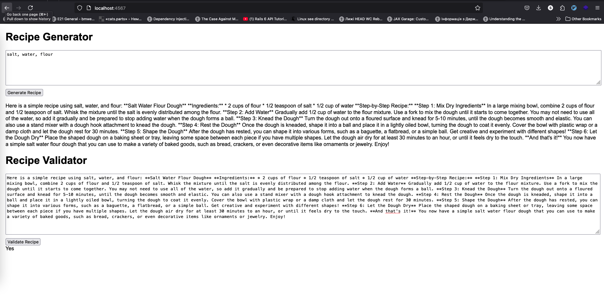

# Seeking Alpha Recipe


## Recipe Generator Web Application

This is a web application that generates step-by-step recipes based on ingredients provided by the user. The recipes are generated using an LLM (Language Learning Model) through the [Groq API](https://groq.com/). The app uses a Sinatra-based backend and a lightweight frontend with native JavaScript.

---

## Features

- Input ingredients to generate a recipe.
- Recipes are generated dynamically using an external LLM API.
- Frontend communicates with the backend through a RESTful API.
- Proper error handling for invalid inputs and API errors.
- Lightweight and easily maintainable architecture.
- Basic unit tests to ensure code reliability.

---

## Technologies Used

- **Ruby Version**: 3.3.6
- **Backend**: Ruby (Sinatra framework)
- **Frontend**: Native JavaScript, HTML, and CSS
- **API Integration**: [Groq API](https://groq.com/)
- **Testing**: Rspec

---

## Installation and Setup

1. **Clone the Repository**:
   ```bash
   git clone git@github.com:transfer76/Seeking-Alpha-Recipe.git
   cd seeking_alpha_recipe
   ```

2. **Install Dependencies**:
   Ensure you have Ruby installed on your system. Then, install the required gems:
   ```bash
   bundle install
   ```

3. **Set Up Environment Variables**:
   Create a `.env` file in the project root and add your Groq API key:
   ```bash
   touch .env
   ```
   Set  `GROQ_API_KEY` and `GROQ_API_URL`
   ```env
   GROQ_API_URL=url_here
   GROQ_API_KEY=your_api_key_here
   ```

4. **Start the Server**:
   ```bash
   ruby app/controller/app.rb
   ```
   The server will run at `http://localhost:4567` by default.

5. **Access the Application**:
   Open your browser and navigate to:
   ```
   http://localhost:4567
   ```

---

## Usage

1. Enter a list of ingredients in the input field.
2. Click the "Generate Recipe" button.
3. View the generated recipe displayed on the same page.

There is possibility to validate recipe
1. Enter a recipe in the field.
2. Click the "Validate Recipe".
3. Answer is 'Yes' if recipe correct or 'No' if recipe is not correct

---

## Testing

Run the tests using the following command:
```bash
rspec app/spec
```

Expected output will confirm if all tests pass successfully.

Rubocop

```bash
bundle exec rubocop
```

---
